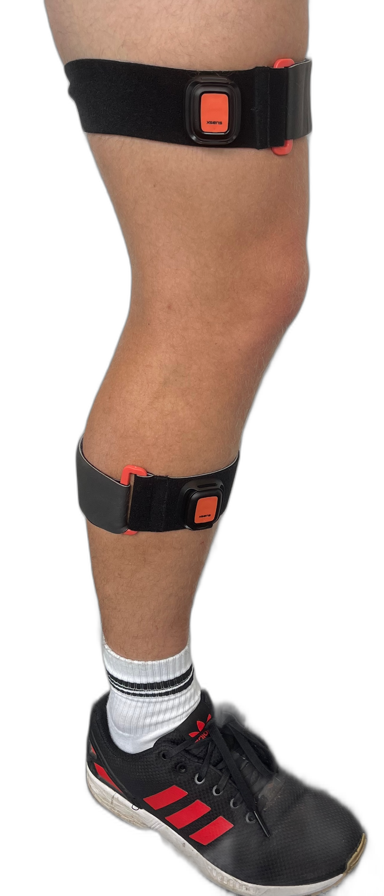

Hey there :wave: Nice to meet you!

My name is Simon Bachhuber, i am a researcher at the **Insitute of Mechatronic Systems** ([IMES](https://www.imes.uni-hannover.de/en/)).

My reseach focuses on developing plug-and-play ML-based methods for state estimation and motion control. A vital part of my work is to develop solutions that eliminate the need for expert knowledge to identify, select, and configure suitable methods; solutions that are less restrictive and simultaneously more accessible!

---

For example, <strong>Inertial Motion Tracking</strong> (IMT) uses wearable inertial sensors to estimate the motion of humans and robots. Unfortunately, current methods require careful selection and precise calibration; effectively, IMT users must be IMT experts!

[RING](https://openreview.net/forum?id=h2C3rkn0zR) is a single neural network that achieves IMT for a broad range of systems and without calibration efforts. This video demonstrates RING's ability, before and after training, to predict the pose (visualized in blue) of kinematic chains from inertial data (IMUs are orange). 
<video width="640" height="480" controls>
  <source src="https://simon-bachhuber.github.io/files/sidebyside_with_labels.mp4" type="video/mp4">
  Your browser does not support the video tag.
</video>

---

My research also focuses on developing plug-and-play motion control methods that enable systems to autonmously learn to perform agile motions. In this video, a soft pnemuatic actuator has learned to perform agile motions from only 30 seconds of input-output data without any model information.

<video width="640" height="480" controls>
  <source src="https://simon-bachhuber.github.io/files/soft_robot_control.mp4" type="video/mp4">
  Your browser does not support the video tag.
</video>

---

If these topics interest you, please feel free to reach out to me :blush:!